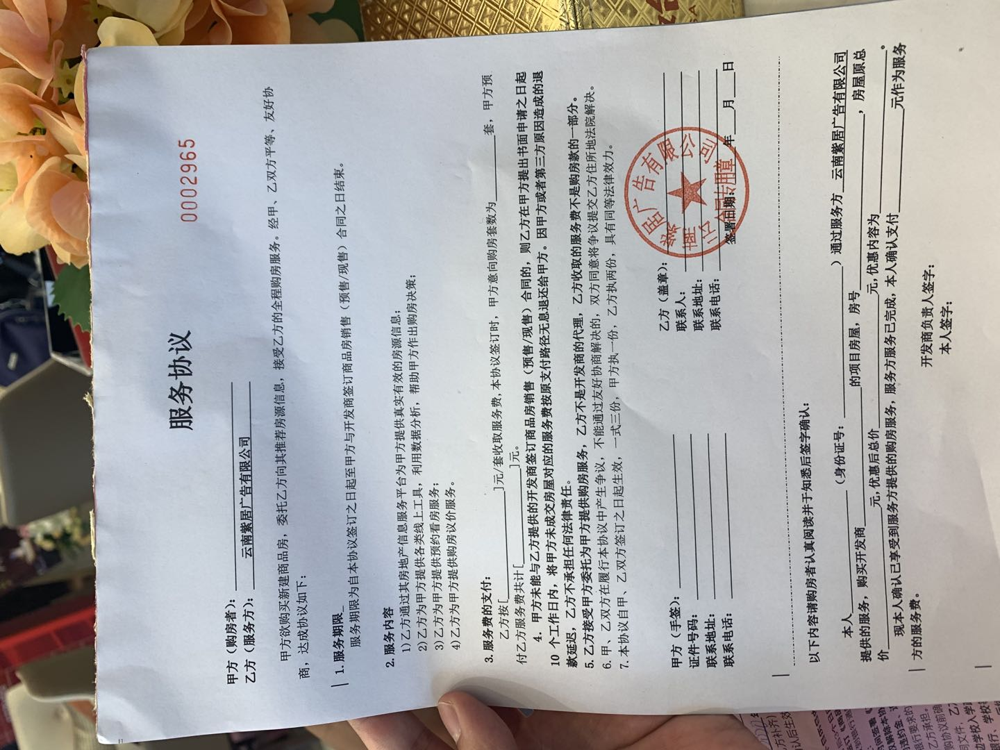

最近在操心买房的事情，可以用焦头烂额来形容。毕竟对于一个普通家庭来说，买房子是一个极其重大的决定，关系着下半辈子的幸福生活。
<!-- more -->

## 买房决定

毕业两年，我都没怎么想过买房的事情，总觉得真正的人生刚开始，不想那么快让自己陷于沉重的房贷压力下，打算好好生活几年。

可人从来都不是独居动物，是耐不住寂寞的，当你拥有了心爱的人时，就会想拥有一个温暖的小家。能给一个小家庭最大的安全感，莫过于一件属于自己的小屋，这是每个人在这个星球上真实拥有的领地。

7月初我和女友开始去售楼部看房，因为每个人首套房的首付和贷款利率都会有很大的优惠，所以我们俩打算一人买一套房，不想浪费这个优惠。我今年准备考研，所以刚开始看房的时候主要是和女友一起看的，我暂时还不打算买。

但是后来看了越来越多的楼盘后，我买房的意愿就愈发强烈，看着房价的疯涨，靠近市区的房子也越来越少，最终决定看上喜欢的我就买。

## 强大支援

我和家里说了想买房的事情，家里也没什么意见，就是再三叮嘱我要买一个自己喜欢的。实际上我刚毕业那年家里就一直想让我赶紧买房，现在想想挺可惜的，两年以来房价又涨了许多，涨幅肯定是超过了收入的。

在我说了想买房的决定后，家里说可以支援我60万元的首付款，当时听了心里是非常高兴的，但是伴随着的有更多的感激。60万元的首付对于一个普通农村家庭来说，已经是非常好的条件，我不敢再有任何要求，对于这60万，我也不敢用的太过草率，这是父母大半辈子的积蓄。这背后的辛苦几乎没人能体会，这也是我想尽快买房的原因，也许我买房成家了，父母就可以好好休息，享受一下生活。

来自父母的60万对于我来说，就像是赢在起跑线上一样，心里充满着希望和底气。当父亲给我转款时，多了一万块，父亲说那是爷爷给的，瞬间感觉很幸福，又有点难过。

## 心路历程

我们刚开始看房的时候，在网上留了自己的信息，几乎每天都会有房产中介打电话要带我们去看房。因为是第一次买房，不知道其间是否有坑，于是我们选了一个看起来挺不错的一个小伙子张毅（化名）带着我们去看，每次都是他开车到楼下接我们，看完又给送回家。

从开始看房到现在我们都在思考和提防会不会被套路，在这个物欲横流的时代，金钱是一种强效的兴奋剂，不敢奢求谁能真心帮你，只能希望少些套路。

刚开始一直让张毅带着我们去看，分别看了西边的3个楼盘和东边的3个楼盘，期间接到过一个中介的电话，说他带我们去看房，成交了可以返给我5000元的佣金，这个电话过后我又开始担心这里面又有些什么套路。于是有一次去看房的路上，我在张毅的车上和他说有个中介说要带我去看房，能返5000佣金，但是我说我已经约好你带我去看了。本来想这样探探张毅的口风，他很沉稳，什么也没说。

张毅带我们看了6个楼盘后，女友的朋友介绍了一个中介司马燕（化名），说她自己开中介公司，可以给我们返1万元佣金。这中间我们想过，也在网上查过通过中介买房和自己去售楼部买房，哪种方式更省钱。但是也没有得到一个明确的答案。所以我们暂时决定之后让司马燕带我们去看。

但是之后遇到的一件事情，让我们决定了绕过中介，自己去售楼部看房。

## 失败经历

张毅带我们去看过的有一个楼盘是比较满意的，地理位置和周边配套都比较理想，靠近城市主干道，有学校，有医院，也有商业。刚好有几套特价房，是一期剩下的最后几套房，建面105平，一口价175万。看到这个消息第二天我就让张毅带着去看了看，楼层也还不错，在售楼部思考了一上午，之后有和家里打电话沟通。到了下午请了一个在昆明的叔叔来帮忙看看，他认识些人给问了一下，说地块可能有些纠纷，等第二天再帮我问问，我也想好了如果没问题的话就买这里。

第二天中午，叔叔给我来电话，说我想买的那栋楼那个地块没有问题，有纠纷的是别的地块，但是可能会有一定影响，风险相比其他楼盘有些大。这样的话我想了一下，觉得我能承受这个风险，毕竟买期房都会有风险，于是又和家里确定之后，联系了置业顾问，交了3万元定金，签了认购协议。

签了认购协议之后，我联系了中介张毅，询问他能不能返一些佣金，结果肯定是一顿卖惨，想想万把块钱，也就算了。

交定金那天是周一，让7天内要付首付，到了周末我带着准备好的首付去售楼部准备办后续的手续。我们在大厅喝着茶，过了一会置业顾问带着些材料过来，和我说先交3万元电商费，我当时心里一愣，怎么额外多出3万快，那我首付没那么多了。当时觉得175万的交易，3万元影响也不大。正当我准备签字的时候，女朋友听到这个电商费，瞬间就爆炸了，一再追问什么是电商费，这时置业顾问拿出来一份服务协议（见下图），内容是我委托这家广告公司想我推荐房源，服务费是3万元。

置业顾问解释说要交这3万元，才能享受这个一口价的优惠。我们都觉得被套路了，这家“云南紫居广告有限公司”我们从来没听过，更不可能花3万元让他给我们推荐房源。当时就让我想起了“奔驰女车主”事件中曝出来的“金融服务费”。实际上这3万块钱并不是我不能接受的金额，而是在签认购协议之前从来没提过这件事情，也从来没听过“电商费“这个词，这要交首付的时候来这么一出，着实让人心里不爽。

我看了两遍认购协议，里面也只字未提”电商费“的事情，协议里面写的价格就是175万。我和女友在售楼部闹了一下午，我坚持就按认购协议上走，后来也叫来了他们的经理。各种打电话询问，查资料，最终以对方违约，退还我定金。

这次经理之后我一直想搞清楚”电商费“（后来查了有的地方叫团购费）到底是怎么一回事。有的说是中介费，有的又说是销售的提成，还有的说是为了避税，但有个比较一致的说法是，这几万块钱不会写到购房合同里，也不会给开发票。所以此次经理之后，我们决定不再找中介了，自己去售楼部看。

后来听说有的开发商所有楼盘都有这个“团购费”。所以之后看房一定会问清楚所有费用。

## 再遇良宅

上一个楼盘退了之后，我们骑着小🛵全城到处跑，找没看过的楼盘继续看。在昆明北边长虫山脚下有一个总高8层的洋房社区，旁边还有一所小学。容积率低，公摊小。我们看了之后都非常喜欢，缺点就是户型不太好，价格有些贵。

我和女友算了一下，虽然价格贵，但是性价比很好，居住品质比较高。说实话，在这之前我都没了解过洋房，我们之前看的都是高层刚需住宅。看了洋房之后，彻底不想住高层了。

这个楼盘看了之后交了个认筹金，8月21日开盘去选房，如果这个房子能买到的话，应该是很理想的。

## 贷款窘境

认筹了之后，担心月供太高（预估7000左右）房贷批不了。便准备了所需的材料，让置业顾问帮忙跑银行确定贷款金额。过了大概一个星期，置业顾问跑了3家银行，分别有不同的情况。第一家由于我有两个月工资是支付宝发的，没有备注发工资，所以不认这个收入，收入不连续不给贷款；第二家银行可以认这两个月的收入，但是流水算下来只能贷80万左右，总价预估190万，还差着50万额度；第三家银行如果我把首付提高到40%（预估75万），可以不看流水，但是贷款利率高出0.2%。

刚开始拿到家里支援的60万，心里充满着希望，以为能买一个自己心仪的房子。但是往往事与愿违，按照如今的收入流水，只能买140万的房子，140万在昆明，要靠近市区近一点，最多只能买90多平的小三房，这样我觉得对不起这60万首付。很多人买房都卡在了首付上，但是我过了首付这一关，却被贷款拒之门外，心里很不是滋味。

当然也并不是没有别的班饭，除了提高首付外，也可以增加共同还款人，需要时直系亲属或配偶，我还没结婚，那只能让父母作为共同还款人。现在也只有这个办法，最终能不能搞定，只能看运气了。

## 一切顺利

几天（2020年8月31日），房贷顺利放款，总共132万贷款，月供7037块。操心了两个月的事情终于告一段落了，接下来的日子就好好学习，努力挣钱💪。
