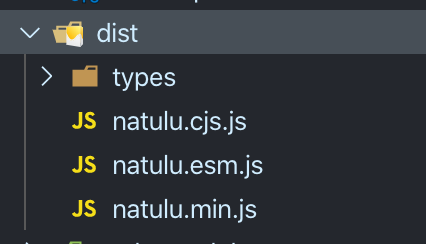

能够封装一个JavaScript库，是一名前端工程师的基本素养。我们可以将经常使用的一些业务逻辑封装成通用的函数库，通过npm包的方式使用。
<!-- more -->

[[warning | 注意]]
| 本文适合阅读对象为入门级前端工程师，需要具有一定的typescript基础，建议先学习[typescript](https://www.tslang.cn/docs/home.html)

选择typescript是因为其具有完善的类型系统，编译后也能够自动生成声明文件（.d.ts文件），为使用者提供类型提示，不用再去手写声明文件

本文以一个简单的示例，带领初学者掌握一个JavaScript工具库的创建、开发、测试、发布的全生命周期

## 相关技术

本文的示例中将使用到以下技术，如有不熟悉的需自行查阅相关文档

* typescript
* rollup - 打包工具

## 创建项目

创建一个名为'natulu'的空目录，你也可以自己起个名字。然后打开终端进入目录下，执行`npm init`初始化npm包，一阵回车之后，得到一个自动创建的文件`package.json`

```json
{
  "name": "natulu",
  "version": "1.0.0",
  "description": "",
  "main": "index.js",
  "scripts": {
    "test": "echo \"Error: no test specified\" && exit 1"
  },
  "author": "",
  "license": "ISC"
}
```

先不管里面这里面的内容，接下来我们先组织一下目录结构

### 目录结构

一般情况都建议将核心的源码放到`src`目录下管理，我们采用常见的目录结构

```text
natulu
├─ dist
├─ src
│  └─ index.ts
├─ package.json
├─ rollup.config.js
└─ tsconfig.json
```

src中存放核心的源码，dist里面为编译打包后的产物，是直接提供给用户使用的代码。上面的目录中有两个文件，分别是rollup配置文件和ts配置文件，这两个文件会在后续的步骤中创建。

### typescript配置文件

拥有`typescript.json`文件，说明这是一个typescript项目，我们可以通过typescript提供的命令初始化一个配置文件

首先安装typescript依赖

```bash
yarn add -D typescript
```

然后通过`tsc`命令来初始化一个配置文件

[[warning | 注意]]
| 这里在tsc命令前加了一个yarn，会自动从当前目录下开始查找ts包，如果直接执行`tsc --init`，会查找到全局安装的typescript

```bash
yarn tsc --init
```

之后我们会看到项目中自动创建了一个tsconfig.json文件，我们修改一部分内容后，保留项目必须的一些选项

```json
{
  "compilerOptions": {
    "target": "es5",  /* 编译目标 */
    "module": "commonjs",  /* 项目模块类型 */
    "allowJs": true,  /* 是否允许js代码 */
    "checkJs": true,  /* 检查js代码错误 */
    "declaration": true,  /* 自动创建声明文件(.d.ts) */
    "declarationDir": "dist/types",  /* 声明文件目录 */
    "sourceMap": true,  /* 自动生成sourcemap文件 */
    "outDir": "./dist",  /* 编译输出目录 */
    "rootDir": "./src",  /* 项目源码根目录，用来控制编译输出的目录结构 */
    "strict": true,  /* 启用严格模式 */
  },
  "include": ["src/index.ts"],
  "exclude": ["node_modules", "dist"]
}
```

## 开发

配置好typescript后，我们就可以开始正式开发啦。

### 编写代码

我们的开发工作主要在`src`目录下，首先我们创建一个`index.ts`文件，写一个加法的函数

```typescript
export function sum (...args: number[]): number {
  return args.reduce((prev, total) => total + prev, 0)
}
```

我们在index.ts中导出了一个`sum`函数，希望在node环境下能直接导入使用，在浏览器环境中也能通过某种方式（如`window.sum()`）使用。

### 拆分代码

如果一直在index.ts文件里面开发，到后期会导致文件非常大，代码凌乱难以维护，为此我们通常将代码拆分出来，index.ts只作为一个入口文件来导出函数。

我们创建一个`sum.ts`文件，将代码移动到里面

```typescript
// sum.ts
export function sum (...args: number[]): number {
  return args.reduce((prev, total) => total + prev, 0)
}
```

然后在index.ts中将其重新导出

```typescript
// index.ts
export { sum } from './sum'
```

这样我们可以将代码按照功能划分模块，放到不同的文件里面，便于组织管理。

### 编译打包

typescript代码是不能直接运行的，需要通过typescript编译器编译成JavaScript代码

#### typscript编译

接下来就处理项目的编译，首先我们尝试用`tsc`命令编译项目，在`package.json`中的`scripts`中添加命令`"build": "tsc"`

```json
"scripts": {
  "build": "tsc",
  "test": "echo \"Error: no test specified\" && exit 1"
},
```

然后执行一下`yarn build`，在dist目录中编译出了能被浏览器兼容的JavaScript代码。但是仔细观察会发现，index.ts和sum.ts都生成了编译后的文件，这样对于node环境或者前端打包工具来说没有影响，但是要直接在浏览器中引入的话，需要引入所有文件。

因此要优雅的兼容浏览器引入的方式，就需要将所有代码合并成一个文件，此时我们需要用到一个打包工具`rollup`。

#### rollup打包

先安装rollup，还需要安装`rollup-plugin-typescript2`插件来编译typescript

```bash
yarn add -D rollup rollup-plugin-typescript2
```

安装好之后在项目根目录创建一个`rollup.config.js`文件，并输入以下配置代码

```javascript
import typescript from 'rollup-plugin-typescript2'
import pkg from './package.json'

export default {
  input: 'src/index.ts', // 入口文件
  output: [
    {
      file: pkg.main, // 输出文件名称
      format: 'cjs', // 输出模块格式
      sourcemap: false // 是否输出sourcemap
    },
    {
      file: pkg.module,
      format: 'esm',
      sourcemap: false
    },
    {
      file: 'natulu.min.js',
      format: 'umd',
      name: 'Natulu', // umd模块名称，相当于一个命名空间，会自动挂载到window下面
      sourcemap: false
    }
  ],
  plugins: [
    typescript()
  ]
}
```

在配置中可以看到，rollup可以指定输出不同模块类型的代码，其中cjs和esm的文件名我们从package.json文件中导入，因此需要修改一下package.json，在里面修改和加入`main`, `module`属性。然后再修改scripts中的build命令为`rollup -c`，再加入一个指定声明文件的属性`types`

```json
{
  "name": "natulu",
  "version": "1.0.0",
  "description": "",
  "main": "dist/natulu.cjs.js",
  "module": "dist/natulu.esm.js",
  "types": "dist/types",
  "scripts": {
    "build": "rollup -c",
    "test": "echo \"Error: no test specified\" && exit 1"
  },
  "author": "",
  "license": "ISC",
  "devDependencies": {
    "rollup": "^2.26.6",
    "rollup-plugin-typescript2": "^0.27.2",
    "typescript": "^4.0.2"
  }
}
```

然后我们执行一下`yarn build`试试


我们遇到了一个报错，大概意思就是typescript配置的源码模块类型为`commonjs`，但是`rollup-plugin-typescript2`不支持`打包commonjs`模块，报错信息里面提供了一个解决方案是修改`tsconfig.json`中的`module`为ES2015或ESNExt。

但是个人不推荐这样做，如果直接修改tsconfig.json的module，可能会导致npm包依赖找不到的问题。我们可以在`rollup-plugin-typescript2`配置中覆盖tsconfig.json的配置。

```javascript
plugins: [
  typescript({
    tsconfigOverride: {
      compilerOptions: {
        module: 'ESNext'
      }
    },
    useTsconfigDeclarationDir: true // 使用tsconfig中的声明文件目录配置
  })
]
```

然后再执行一下`yarn build`，可以看到dist中已经产出了不同模块格式的文件，看起来干净清爽。



#### 代码压缩

通常，umd包会在浏览器中直接引入使用，有一个硬性需求就是代码体积压缩以及代码混淆，有一个代码混淆插件`rollup-plugin-terser`，可以很轻松的解决这个问题。

```bash
yarn add -D rollup-plugin-terser
```

然后在rollup.config.js中添加注册terser插件，由于我们只需要给umd包进行代码混淆，因此只需要在umd的输出配置中注册插件即可

```javascript
import typescript from 'rollup-plugin-typescript2'
import pkg from './package.json'
import { terser } from 'rollup-plugin-terser'

export default {
  input: 'src/index.ts',
  output: [
    {
      file: pkg.main,
      format: 'cjs',
      sourcemap: false
    },
    {
      file: pkg.module,
      format: 'esm',
      sourcemap: false
    },
    {
      file: 'dist/natulu.min.js',
      format: 'umd',
      name: 'Natulu',
      sourcemap: false,
      plugins: [
        terser()
      ]
    }
  ],
  plugins: [
    typescript({
      tsconfigOverride: {
        compilerOptions: {
          module: 'ESNext'
        }
      },
      useTsconfigDeclarationDir: true // 使用tsconfig中的声明文件目录配置
    })
  ]
}
```

再来一次`yarn build`，能看到`natulu.min.js`文件已经被压缩成一行代码。

## 发布npm

完成代码的编写和打包，接下来就可以将它发布到npm上，让所有开发者都能使用。

[[tip | 提示]]
| 为了保证库的稳定性，通常会在发布之前进行单元测试，推荐阅读[《为你的库集成单元测试和CI/CD》](/post/test-your-library/)。

发布到npm上需要先拥有一个npm账号，[npm官网](https://www.npmjs.com/)提供免费注册账号，具体注册流程不再赘述。

注册好npm账号之后，需要在本地进行一下账号登陆。

[[warning | 注意]]
| 如果使用了其它npm镜像源，需要先切换为npm官方源，否则可能无法正常发布

在终端中输入命令`npm login`登陆npm


登陆成功后，执行`npm publish`即可。

### 注意事项

* 每次发布，package.json文件中的version要比上一次高
* 如果不想将一些文件发布到npm，可以使用.npmignore文件，其语法与.gitignore类似

## 在项目中使用

我们在package.json中指定了`main`和`module`属性，可以告诉使用者要引入哪个文件。

在有打包工具（如webpack）或node项目中，可以直接使用`import`语法和`require`语法引入使用

```javascript
import { sum } from 'natulu'
const { sum } = require('natulu')
```

我们提供了压缩后的umd版本，可以在网页中直接通过`<script>`标签引入

```html
<script src="path/to/natulu.min.js"></script>
<script>
  Natulu.sum(1,2) // 3
</script>
```
