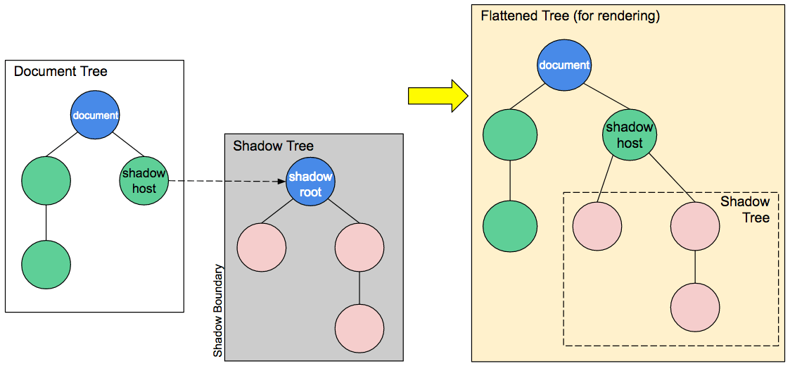

`web-components`是一个比较新的开发技术，但组件化思想已经实际应用了很长时间，代表性的组件话框架有`vue`, `react`等。`web-components`可以直接使用原生`HTML`和`Javascript`来封装通用的web组件，其拥有简单直接、无任何依赖等特点，是web前端开发的一个强有力的技术。
<!-- more -->

**文章前半部分讲`web-components`相关接口，最后有一个[进度条组件](#进度条组件)实例，[点击这里](#进度条组件)可直接跳转。**

## Web-Components API

[Web-Components API](https://developer.mozilla.org/zh-CN/docs/Web/Web_Components)有三个核心部分，分别是：`Custom elements`, `Shadow DOM`, `HTML templates`。

### Custom elements

`custom elements`顾名思义，允许我们自定义通用的HTML标签，可以是一个包含特定功能如：日历、时间显示、进度条等。

**创建自定义元素**
使用自定义元素，必须先使用[`customElements.define(name, constructor, options)`](https://developer.mozilla.org/zh-CN/docs/Web/API/CustomElementRegistry/define)方法注册元素后才能使用，参数分别为元素名称，元素构造函数，选项（可选）。**自定义元素名称不能是单个字母**。

**生命周期**
自定义元素生命周期有4个回调函数：

* connectedCallback：当custom element首次被插入文档DOM时调用。
* disconnectedCallback：当custom element从文档DOM中删除时调用。
* adoptedCallback：当custom element被移动时调用。
* attributeChangedCallback：当custom element增加、删除、修改自身属性时调用。

### Shadow DOM

通常情况下，我们封装web组件的时候，需要将组件内部的样式封装进去，同时也要避免被外部样式干扰。`Shadow DOM`是隐藏在一个DOM节点里面的节点树，主要特点就是于外部DOM树隔离，使组件维护成本大大降低。`Shadow DOM`并不是新鲜玩意儿，而是浏览器内部API实现，我们常用的一些标签如带控制按钮的`video`标签，其内部就是一个`Shadow DOM`树。

**创建Shadow DOM**
`Shadow DOM`有几个核心概念：

* `Shadow host`: 一个常规 DOM节点，Shadow DOM会被添加到这个节点上。
* `Shadow tree`: Shadow DOM内部的DOM树。
* `shadow root`: `Shadow tree`的根节点。
* `Shadow root`: Shadow tree的根节点。
* `Shadow boundary`: Shadow DOM结束的地方，也是常规 DOM开始的地方。


<center>Shadow DOM</center>

创建`Shadow DOM`需要用到`attachShadow({ mode: 'open' })`方法，参数中`mode`的取值有两个：`open`, `closed`，用来配置是否可以从外部获取`shadow tree`。该函数返回一个`Shadow Root`。

要获取一个`shadow tree`，可以使用`Element.shadowRoot`方法，如果`shadow dom`的mode选项为`closed`，那么改属性值为`null`。

示例:

```javascript
const shadowRoot = el.attachShadow({ mode: 'closed' })
shadowRoot.appendChild(childEl)
```

### HTML templates

`HTML`模板包含两个标签：`<template>`和`<slot>`，如果有熟悉`vue`的同学对这两个标签应该不会陌生，其用法也非常相似。

**创建template**
在编写web组件的时候，使用JavaScript来编写HTML会有诸多不便，`<template>`标签给我们提供了一个非常便捷的方式来编写`HTML`部分的代码，一个简单的示例：

```html
<template id="my-paragraph">
  <p>My paragraph</p>
</template>
```

可以在JavaScript中来引用模板

```javascript
let template = document.getElementById('my-paragraph');
let templateContent = template.content;
document.body.appendChild(templateContent.cloneNode(true)); // cloneNode方法克隆整个节点，为了避免模板在多个地方被引用引发问题
```

**添加slot**
`slot`翻译为“插槽”，有时候，我们的组件需要提供更灵活的方式来展现，比如进度条组件可在使用的时候，自定义文字显示。这个时候`slot`便大有用处。我们通过一个简单的示意图来理解插槽的作用。

## 进度条组件

说了这么多，来实际操练一下，编写一个简单的进度条组件。

### 基本功能

* 图形化显示进度
* 可定制进度条显示文字

### 效果演示

<input type="range" id="range-btn" min="0" max="1" step="0.01" value="0.5">

<!-- 使用组件 -->
<div id="my-progress-mount"></div>

(如果没有渲染出来，请刷新一下当前页面)

### 实现

组件模板

```html
<template id="my-progress-template">
  <style>
    .bg {
      width: 300px;
      height: 30px;
      border-radius: 15px;
      box-shadow: 0 0 4px 0 #2db7f5 inset;
      overflow: hidden;
    }
    .bar {
      height: 30px;
      width: 0;
      line-height: 30px;
      border-radius: 15px;
      box-shadow: 1px 0 2px 0 #2db7f5;
      background-color: #2db7f5;
      text-align: center;
      font-size: 14px;
      box-sizing: border-box;
      /* transition: width .3s ease-in-out; */
    }

    .bar .text {
      color: #fff;
    }
  </style>

  <div class="bg">
    <div class="bar">
      <slot class="text" name="text"></slot>
    </div>
  </div>
</template>
```

组件构造器

```javascript
/**
 * 进度条组件构造函数
 * 继承HTMLElement
 */
class MyProgress extends HTMLElement {

  // 注意⚠️，attributeChangedCallback回调需要添加此方法，返回要监听变动的属性
  static get observedAttributes () {
    return ['value']
  }

  constructor (...args) {
    super(...args)
    this.init()
  }

  init () {
    let template = document.getElementById('my-progress-template')
    const shadow = this.attachShadow({ mode: 'open' })
    shadow.appendChild(template.content.cloneNode(true))
  }

  attributeChangedCallback (name, oldValue, newValue) {
    if (name === 'value') {
      const root = this.shadowRoot
      const bar = root.querySelector('.bar')
      let number = +newValue
      if (number > 1 || number < 0) {
        bar.style.width = 0
        throw new Error('progress value must between 0 and 1')
      }
      bar.style.width = number * 100 + '%'
    }
  }
}
```

> 完整代码查看连接：[https://github.com/YES-Lee/blob/master/demo/simple-progress-bar.html](https://github.com/YES-Lee/blob/master/demo/simple-progress-bar.html)

## 参考连接

* [Web Components 入门实例教程](http://www.ruanyifeng.com/blog/2019/08/web_components.html), 阮一峰
* [Custom Elements v1: Reusable Web Components](https://developers.google.com/web/fundamentals/customelements), Eric Bidelman
