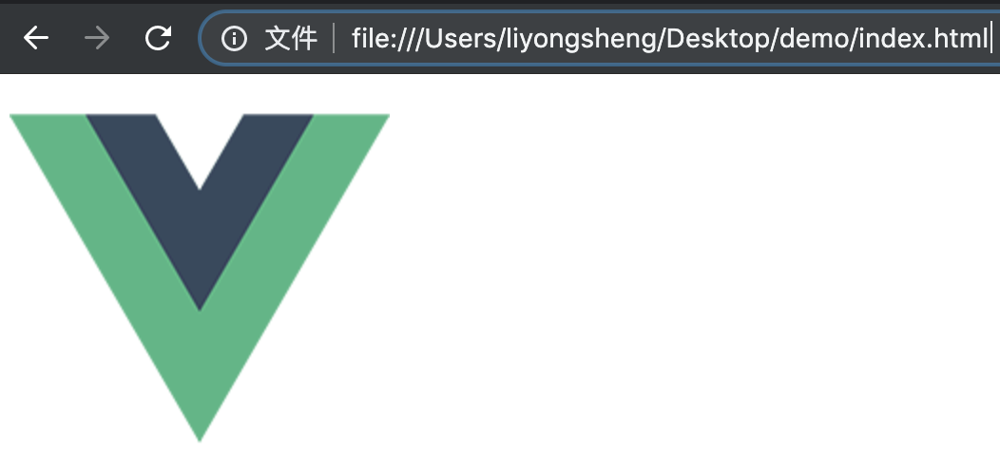
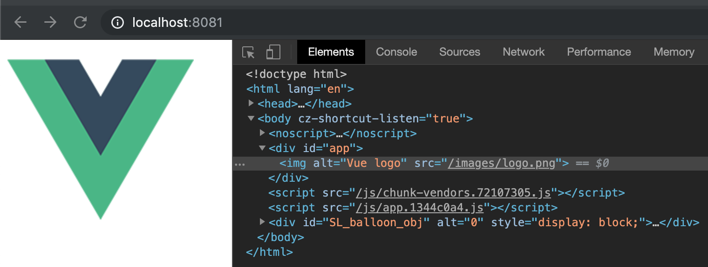
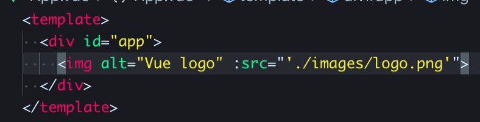

---

title: 一篇文章彻底解决图片 404 问题
date: 2019-09-18 15:35:40
thumbnail: ./cover.jpg
categories:

- 技术
  tags:
- 前端
- vue
- http
- webpack
  keywords:
- vue 图片 404
- webpack 打包图片
- 前端打包 404
  ---在前端工程打包部署过程中，经常会有同学遇到图片等静态资源 404 的问题，这些问题都是于打包后资源路径不正确导致的。本文就从基础开始，讲解如何分析并解决此类问题。

<!-- more -->

## 绝对路径于相对路径

首先先搞清楚绝对路径和相对路径的区别。绝对定位就是从根目录开始，二相对路径是以当前路径为参考，从标记上来看，绝对路径是以`/`开头的路径，而相对路径是以`./`或者文件(文件夹)名称开头的路径。

## web 中的路径

前面简单的讲了绝对路径和相对路径的定义和区别，下面，开始重点讲在 web 中的资源路径。

在浏览器中访问 web 有两种方式，一种是直接在浏览器中打开`.html`文件，另一种是通过一个 IP 或域名访问部署在静态资源服务器（web 服务器）中的网页。分别来分析两种情况。

### 直接打开`.html`文件

在文件系统中，绝对路径以根目录或盘符开始，比如：`/Users/Johnson/Document`（Linux/Unix）和`C:\Users\Johnson\Document`（windows）。如果我们直接从浏览器加载`index.html`页面，那么浏览器中的地址是该文件在系统中的绝对路径。

在 unix 或类 unix（如 macOS）系统中，以`file://`开头，在 windows 中以盘符开头。我们先看一下这个图片的路径

可以看到，写的是相对路径，浏览器从文件系统中也通过相对路径加载图片。然后，换成绝对路径试试。

图片也能正常加载，但是我们平时在`web`开发过程中通过绝对路径应用资源并没有写文件在磁盘中的真实路径，而是像这样写

然后再打开，会发现图片无法显示了，从调试工具中可以看到，浏览器直接从系统根目录查找文件

因此，如果我们的 web 应用需要打包成桌面应用/移动 app，那么一般情况只能使用以`./`开头的相对路径，除非打包的应用中集成了静态资源服务。

### 从 web 服务器访问

Web 服务器会给每一个 web 应用的目录分配一个域，我们可以直接通过 IP 地址或者域名来访问。当在浏览器中访问该 web 应用时，会将绝对路径的根目录代理到项目所在目录。看一个 vue 实例：将项目打包后，使用`http-server`为 dist 目录开启一个代理

同样适用绝对路径，通过网络调试器看到资源从`http://localhost:8081/images/logo.png`请求来的，服务器将`http://localhost:8081/`部分映射到了`/Users/liyongsheng/Documents/path-problem/dist`路径下，这样就能正确获取到绝对路径标记的资源。同样的，我们也可以使用以`./`开头的相对路径。

## webpack 打包静态资源路径

在`webpack`打包过程中，使用相应的插件可以将静态资源打包到模块化的代码中。这里重点讲在标签中的`src`资源。以`vue`项目为例，如果`src`写的是以`/`开头的绝对路径，则不做任何处理，如果是以`.`,`~`,`@`开头，则会被`webpack`当作模块打包，具体参考[`vue-cli`官方文档](https://cli.vuejs.org/zh/guide/html-and-static-assets.html#url-%E8%BD%AC%E6%8D%A2%E8%A7%84%E5%88%99)。

因此，如果不希望静态资源被打包到模块化代码中，我们可以使用绝对路径来引入资源，如下图所示：

也可以使用相对路径，但是使用相对路径会被`webpack`打包，编译的时候就会报错

要避免这个问题，可以使用数据绑定

### publicPath

`pablicPath`是 webpack 的一个配置项，用于指定资源根目录，默认为`/`。大多数图片 404 问题都是因为网站部署到二级目录下，比如域名为`www.a.com`，那么如果网站部署到`www.a.com/b/`下面，就会导致图片 404 问题，调试可以发现浏览器是从`www.a.com`下面请求资源，但是实际上应该是`www.a.com/b/`下面亲求，一般只用修改`publicPath`为`/b/`就可以解决，这样浏览器会从`www.a.com/b/`下面去请求资源。

### 打包 app 的情况

将 web 项目打包为 app 的时候，一般都是通过 webview 直接从文件系统中加载页面，这里由于没有 web 服务器，绝对路径就会被解析到系统根目录下。因此`publicPath`需要设置为相对路径`publicPath: ''`或`publicPath: './'`

同时，页面中引用的图片资源也不能使用绝对路径，而是要使用`./`开头的相对路径。

## 总结

经过上述分析，兼容性最好的就是使用相对路径，至于需不需要被 webpack 处理，只需要切换 src 的绑定方式即可。如果只部署 web，使用绝对路径是最好的选择，如果还要兼容其它情况，建议使用相对路径。
