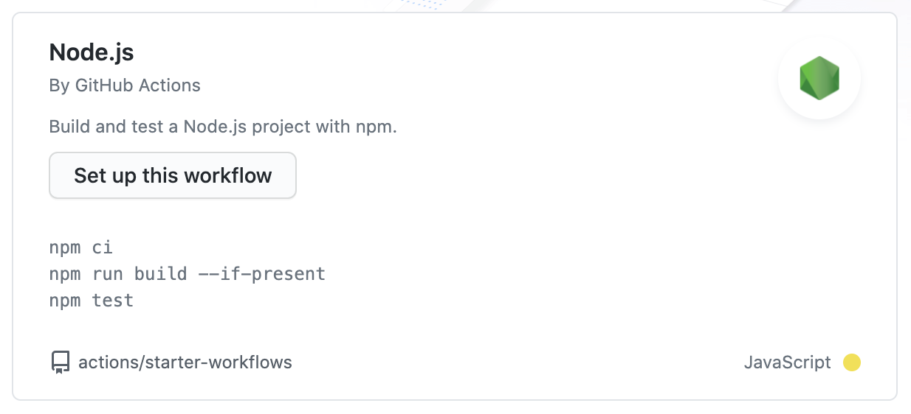

在开发工具库的时候，为保证代码的稳定性和健壮性，我们需要编写完善的测试程序。同时也会集成 CI/CD 等工具优化工作流，提高开发效率。

<!-- more -->

**如果你还不清楚如何开发一个 js 库，可以阅读[《typescript 开发工具库入门》](/develop-a-library-based-typescript/)**

对于一个成熟的 JavaScript 库，单元测试是必要的。现有的 JavaScript 测试框架有很多，`karma`, `mocha`, `sinon`, `jasmine`, `jest`等，其中`jest`是 Facebook 开源的一个开箱即用的测试框架，使用起来非常简单方便。本文将为[《typescript 开发工具库入门》](/develop-a-library-based-typescript/)中的示例库[natulu](https://github.com/YES-Lee/natulu)集成 jest 单元测试。

## 安装测试框架

我们的项目使用的是 typescript，所以需要配置 jest 以支持 typescript。幸运的是已经有提供了`ts-jest`库来解决这个事情，我们只需要简单的配置就能使用。

```bash
yarn add -D jest ts-jest @types/jest
```

## 创建配置文件

执行以下命令自动创建一个 jest 配置文件

```bash
yarn ts-jest config:init
```

生成的配置文件如下

```javascript
module.exports = {
  preset: 'ts-jest',
  testEnvironment: 'node', // 如果是浏览器环境，可以设置为jest-environment-jsdom或删除该配置项
}
```

也可以使用 jest 来创建配置文件

```bash
yarn jest --init
```

按照步骤选择合适的选项后，将`preset`设置为`ts-jest`

```javascript
module.exports = {
  coverageDirectory: 'coverage', // 单元测试覆盖率生成目录
  preset: 'ts-jest',
  testMatch: ['**/__tests__/**/*.[jt]s?(x)', '**/?(*.)+(spec|test).[tj]s?(x)'],
}
```

然后我们在 package.json 的 scripts 中添加或修改`test`命令和`dev`命令

```json
{
  "scripts": {
    "dev": "jest --watch",
    "test": "jest --coverage"
  }
}
```

`dev`命令为开发模式下使用，其中的`--watch`选项可以监听文件变化，重新执行单元测试脚本。`test`命令中的`--coverage`选项为指定是否生成测试覆盖率报告。

## 使用 GitHub Action 集成 CI/CD

我们在发布代码库的时候，需要进行手动编译、执行单元测试、发布。这个流程手动进行对于团队协作效率和质量有一定的影响，我们可以利用 Github Action 来进行持续集成，在提交代码的时候自动跑测试、编译等任务。

点击 GitHub 仓库首页中的 Actions 按钮后选择推荐的 workflow 中的 Node.js



将配置文件修改为

```yml
name: Node.js CI

on:
  push:
    branches: [master]
  pull_request:
    branches: [master]

jobs:
  build:
    runs-on: ubuntu-latest

    strategy:
      matrix:
        node-version: [10.x]

    steps:
      - uses: actions/checkout@v2
      - name: Use Node.js ${{ matrix.node-version }}
        uses: actions/setup-node@v1
        with:
          node-version: ${{ matrix.node-version }}
      - run: npm i
      - run: npm run build --if-present
      - run: npm test
```

然后点击右上角绿色按钮`Start commit`，便会执行第一次 workflow，在之后 master 分支的 push 和 merge pull request 操作都会触发自动执行 action 任务。

**可以自己尝试在 action 中自动发布 npm 包**
