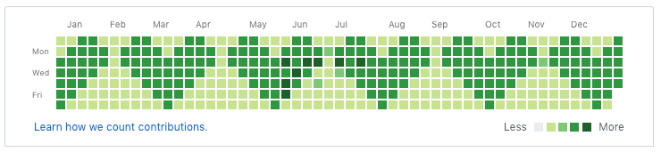

细心的人都会发现 GitHub 个人主页有一个记录每天贡献次数的面板，我暂且称之为贡献面板。就像下图那个样子。只要当天在 GitHub 有提交记录，对应的小格子就会变成绿色，当天提交次数越多，颜色也会越深。因此我就有了一个大胆的想法。细心的你应该也发现了，我就是要讲如何搞出这个小 ❤️❤️ 来。项目地址：[https://github.com/YES-Lee/git_painter](https://github.com/YES-Lee/git_painter)

 <!-- more -->



## 原理

基本原理前面已经讲过，我们只需要控制项目提交的日期和次数，就能在贡献面板中填充出花样来。可能有朋友会问，前面的部分怎么办？拿到我得等一年？No☝️，经过研究发现，GitHub 的贡献面板是活得，什么意思呢？GitHub 是根据项目的提交记录实时生成的贡献面板，所以只要在本地把时间改成过去，进行提交操作，再 push 到 GitHub，就实现了穿越。了解了这些之后，就可以动手了。最后如果效果不尽人意或者像换个图样换个心情，只需要删了对应的仓库就行了。

> **坑 1：码云不像 GitHub，码云的贡献面板是一次性的，推上去之后就不会变，所以谨慎操作**

## 程序设计

### 目标

1. 设计一个模板，可以通过修改模板来改变图样
2. 将过去时间的记录自动全部填充
3. 每天进行自动`COMMIT`/`PUSH`操作

### 实现

1. 模板设计成一个`json`二维数组，由`0`和`1`组成，分别到表有/无提交记录。行数最好固定是 7（周一到周日），列数可以自已随意设置。下面是基于`python`的实现。

model.json

```json
[
  [0, 1, 1, 0, 0, 0, 1, 1, 0, 0],
  [1, 1, 1, 1, 0, 1, 1, 1, 1, 0],
  [1, 1, 1, 1, 1, 1, 1, 1, 1, 0],
  [0, 1, 1, 1, 1, 1, 1, 1, 0, 0],
  [0, 0, 1, 1, 1, 1, 1, 0, 0, 0],
  [0, 0, 0, 1, 1, 1, 0, 0, 0, 0],
  [0, 0, 0, 0, 1, 0, 0, 0, 0, 0]
]
```

下面的代码是根据当前日期和模板对应的值来进行提交，用于定时任务每天执行。可以直接部署到服务器，通过后面的命令设置定时任务。
main.py

```python
#!/usr/bin/env python3
# -*- coding: utf-8 -*-
import json
import os
import time
import datetime


def calculate_date(start, end):
    # 计算日期相差天数
    start_sec = time.mktime(time.strptime(start, '%Y-%m-%d'))
    end_sec = time.mktime(time.strptime(end, '%Y-%m-%d'))

    days = int((end_sec - start_sec) / (24 * 60 * 60))

    return days


def commit(flag):
    if flag:
        for n in range(49):  # 设置commit次数
            with open('./record.txt', 'a') as record:
                record.write('.')
                record.close()
                os.system('git commit -a -m \"HeartBeat\"')

    else:  # 每天推一条
        with open('./record.txt', 'a') as record:
            record.write('.')
            record.close()
            os.system('git commit -a -m \"HeartBeat\"')

    os.system('git pull && git push origin master')


with open('./model.json') as f:  # 加载模型
    PATTEN = json.loads(f.read())
    f.close()

PERIOD = len(PATTEN[0])  # 周期(图案列数)

START_DATE = '2017-7-16'  # 开始日期，很重要，左上角提一格的日期，自己手动修改
now = datetime.datetime.now().strftime('%Y-%m-%d')

row = calculate_date(START_DATE, now) % 7
col = int(calculate_date(START_DATE, now) / 7) % PERIOD

commit(PATTEN[row][col])
```

开启定时任务

```bash
crontab -e
#  输入以下代码，前两个参数分别是分钟和小时，该任务为每天12:00定时执行
# 00 12 * * * cd /home/git_heart && git pull && /usr/bin/python main.py

```

2. 定时任务只能帮我完成今天及以后的事情，之前的也需要写个脚本跑一下。

loop.py

```python
#!/usr/bin/env python3
# -*- coding: utf-8 -*-
import json
import os
import time
import datetime


def calculate_date(start, end):
    # 计算日期相差天数
    start_sec = time.mktime(time.strptime(start, '%Y-%m-%d'))
    end_sec = time.mktime(time.strptime(end, '%Y-%m-%d'))

    days = int((end_sec - start_sec) / (24 * 60 * 60))

    return days


def add_days(d, num):
    # 日期递增
    sec = num * 24 * 60 * 60
    now_sec = time.mktime(time.strptime(d, '%Y-%m-%d')) + sec
    return time.strftime("%Y-%m-%d", time.localtime(now_sec))


def commit(flag):
    if flag:
        for n in range(49):
            with open('./record.txt', 'a') as record:
                record.write('.')
                record.close()
                os.system('git commit -a -m \"HeartBeat\"')

        with open('./record.txt', 'a') as record:
            record.write('\n')
            record.close()
            os.system('git commit -a -m \"HeartBeat\"')

    else:
        with open('./record.txt', 'a') as record:
            record.write(now + '\n')
            record.close()
            os.system('git commit -a -m \"HeartBeat\"')


with open('./model.json') as f:  # 加载模型
    PATTEN = json.loads(f.read())
    f.close()

PERIOD = len(PATTEN[0])  # 周期(图案列数)

START_DATE = '2017-7-16'  # 开始日期, 码云和git显示不一样, 建议从最左上角开始
now = datetime.datetime.now().strftime('%Y-%m-%d')

os.system('timedatectl set-ntp false') # 关闭时间自动同步

while calculate_date(START_DATE, now) >= 0:
    row = calculate_date(START_DATE, now) % 7
    col = int(calculate_date(START_DATE, now) / 7) % PERIOD
    commit(PATTEN[row][col])

    now = add_days(now, -1)
    os.system('timedatectl set-time ' + now)

#  复原时间
os.system('timedatectl set-ntp 1 && timedatectl set-local-rtc 1')
```

到这里基本就结束了，第三个目标实际上在第一步就已经完成了，下面上一下测试结果。

## 效果展示

1. 小心心

```json
[
  [0, 1, 1, 0, 0, 0, 1, 1, 0, 0],
  [1, 1, 1, 1, 0, 1, 1, 1, 1, 0],
  [1, 1, 1, 1, 1, 1, 1, 1, 1, 0],
  [0, 1, 1, 1, 1, 1, 1, 1, 0, 0],
  [0, 0, 1, 1, 1, 1, 1, 0, 0, 0],
  [0, 0, 0, 1, 1, 1, 0, 0, 0, 0],
  [0, 0, 0, 0, 1, 0, 0, 0, 0, 0]
]
```


2. X

```json
[
  [0, 0, 0, 0, 0],
  [1, 0, 0, 0, 1],
  [0, 1, 0, 1, 0],
  [0, 0, 1, 0, 0],
  [0, 1, 0, 1, 0],
  [1, 0, 0, 0, 1],
  [0, 0, 0, 0, 0]
]
```


